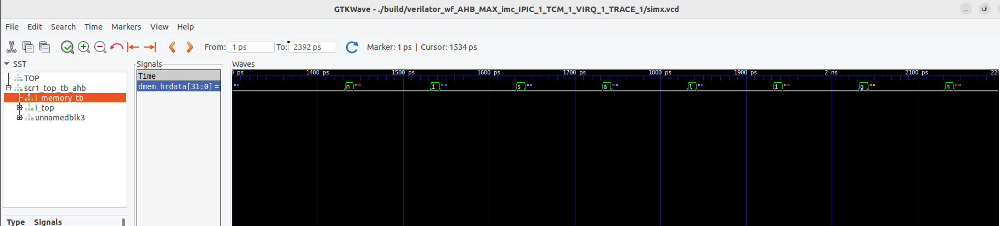

# lab-src1_sim

## Задание
| Номер варианта  | Вид исключения | Тест | Reset Vector | Trap Vector | Обработчик |
| --- | --- | --- | --- | --- | --- |
| 5  | Instruction address misaligned  | isa/rv32mi/ma_fetch.S | 0xA000 | 0x8c0 | Вывод строки «misalign»|

## Ход работы
1. Изменен список тестов в файле **.../scr1/sim/tests/riscv_isa/rv32_tests.inc**.
2. Модифицированны вектора прирываний и ресетов в процессоре. **/scr1/src/includes/scr1_arch_description.svh**.
3. В файлах **sim/tests/common/link.ld** и **sim/tests/common/riscv_macros.h** откорректировано смещение кода.
4. В файле **sim/tests/common/riscv_macros.h** модифицирована обработка прерываний для вывода строки 'misalign'.
5. сборка процессора производилась с помощью команды **make run_verilator_wf TARGETS="riscv_isa"  TRACE=1*
6. В результате получены:
- **ma_fetch.elf** - результирующий исполняеый файл теста
- **ma_fetch.dump** - дамп-файл теста выборки инструкций
- **ma_fetch.hex** - исполняемый файл теста, переведённый в машинные инструкции
- **sim_result.txt** - консольный вывод теста
- **simx.vcd** - waveform теста
- **test_info** - файл с перечислением выполненых тестов
- **test_result.txt** - статус тестов
- **tracelog_core_0.log** - лог выполнения тестов

Waveform теста:

