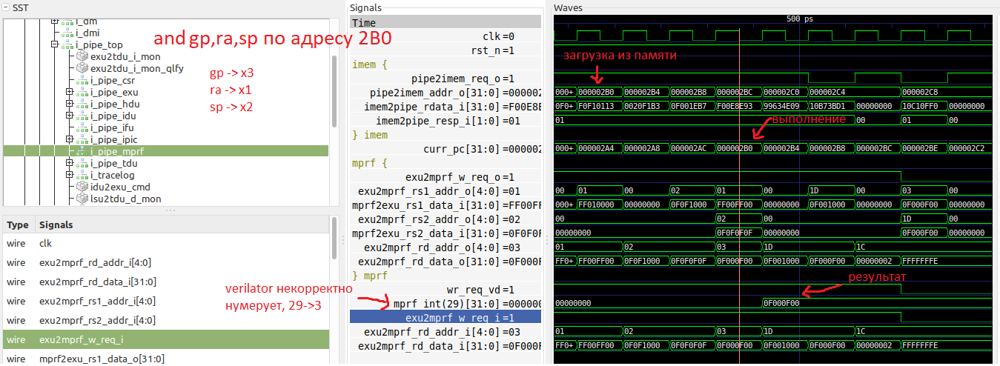

Лабораторная работа 3 (дополнительное задание)
==============================================
:toc:
:toclevels: 4
:numbered:

== Цель
Познакомиться с архитектурой пайплайна SCR1. Доработать тестбенч для вывода информации об микроархитектурном состоянии и состоянии конвеера при выполении определенной команды.

== Задание

1. В вашей копии репозитория scr1 (в форке) из лабораторной 2 необходимо добавить ветку lab3_scr1_pipe_analys.
2. Запустить тест, в котором используется заданная по варианту команда.
3. В соответствии с вариантом исследовать выполнение заданной команды на пайплайне. Вывести на диаграмму следующие значения, а также дополнительно сигналы поясняющие работу пайплайна по вашему усмотрению.
* clk - тактовый импульс
* curr_pc - текущее значение счетчика команд, соответствует стадии Execution
* набор сигналов для Instruction Fetch:
** imem_req - запрос от процессора в память инструкций
** imem_addr - адрес запроса памяти инструкций
** imem_resp - ответ памяти инструкций
** imem_rdata - данные чтения памяти инструкций
4. Добавить несинтезируемый блок в верификационное окружение scr1. Верификационное окружение должно отслеживать выполнение определенной конструкции и в случае обнарежения конструкции в пайплайне выводить отладочную информацию. Отладочная инфомрация определяется в соответствии с вашим вариантом.
5. Добавить в папку report в вашей ветке scr1 скрин с wave формой на которой отражено выполнение вашей команды. Также добавить вывод вашего отладочного модуля.
6. Закоммитить и запушить изменения на github.

== Варианты заданий

[cols="4,7,7,7"]
|===
|Номер варианта | ФИО | Исследуемая команда | Отладочная информация

| 1
| Якупов Данис
| addi
| Вывести PC

| 2
| Мальцев Иван
| sub
| Вывести регистры состояния

| 3
| Попов Савелий
| add
| Вывести значения атрибутов команды

| 4
| Табунщик Сергей
| and
| Вывести PC

| 5
| Булыгин Александр
| xor
| Вывести регистры состояния

| 6
| Зенкин Владислав
| or
| Вывести значения атрибутов команды

| 7
| Мостовая Валерия
| sll
| Вывести регистры состояния

| 8
| Салонина Екатерина
| srl
| Вывести значения атрибутов команды

|=== 

== Пример выполнения

Пример выполнения доступен в https://github.com/v-crys/scr1/commit/f1a339468720f9924b482aa40b8fc52a628f7473 . Смотрите ветку lab3_scr1_pipe_analys. Полезно посмотреть изменения по коммиту.

Задача: Проанализировать работу команды *"and"* в пайплайне процессора. Дорабоатть тестовое окружение таким образом, чтобы при выполнении команды *"and"* в терминал выводилось сообщение "detected command: and".

* Перейдем в проект из второй лабораторной и перейдем на новую ветку от ветки мастер.

[source,bash]
----
cd <scr1_your_folder>
git stash --keep-index # убираем все незакомиченные изменения
git checkout master # переключаемся на ветку мастер
git checkout -b lab3_scr1_pipe_analys
----

* По аналогии с второй лабораторной убираем все тесты кроме одного, в котором тестируется ваша команда.

* Проверяем работоспособность теста. Прописываем путь до тулчейна и запускаем симуляцию с verilator для записи wave.

[source,bash]
----
PATH=/home/vk/files/riscv-tools/riscv-gcc-10.2.0-gbbc9263-210318T1412/bin:$PATH
make clean
make run_verilator_wf TARGETS="riscv_isa" TRACE=1
----

* На wave форму добавляем все интересующие нас сигналы. Пример обработки команды:	
 
----
 2b0:	0020f1b3  and	gp,ra,sp
----

* Добавляем верилог модуль, выполняющий детектирование необходимого события и вывод информации об этом событии. Пример такого блока:

----
module scr1_tb_log_cmd();

always_ff @(posedge scr1_top_tb_ahb.i_top.i_imem_ahb.clk) begin
    if (scr1_top_tb_ahb.i_top.i_imem_ahb.imem_resp == 2'b01) begin
        // valid data from ahb router
        if (
            (scr1_top_tb_ahb.i_top.i_imem_ahb.imem_rdata[6 : 0] == 7'b0110011) &
            (scr1_top_tb_ahb.i_top.i_imem_ahb.imem_rdata[14 : 12] == 3'b111)
        ) begin
            // detect and command
            $display("Detect AND command");
        end
    end
end

endmodule
----

== Дополнительная информация

=== Настройка симуляции SCR1 для Verilator 

Задание выполнять на своей личной рабочей машине с Unix-подобной системой (в т.ч. это может быть
виртуальная машина). На рабочей машине необходимо установить следующее программное обеспечение:

* GNU make версии 4.0 или выше https://www.gnu.org/software/make/
* Открытый симулятор Verilator версии 4.0 или выше https://www.veripool.org/wiki/verilator (*Необходимо собрать из исходников самый последний, apt install не использовать*)
* RISC-V GNU toolchain https://syntacore.com/page/products/sw-tools
* Клонировать ваш рабочий репозиторий SCR1 на рабочую машину
* Ознакомиться с описанием ./README.md раздел «Simulation quick start guide», выполнить описанную в нем настройку окружения и запуск симуляции для Verilator:
** настроить пути для RISC-V toolchain
** настроить пути для Verilator
** клонировать RISC-V ISA, RISC-V Compliance и Coremark тесты и настроить переменные среды,
** запустить симуляцию для Verilator и убедиться, что тесты успешно проходят.
** Между перезапусками рекомендуется делать очистку директории build, используя команду make clean
* Добавим вывод сообщения по обработке события

=== Документация на SCR1

* SCR1 User Manual https://github.com/syntacore/scr1/blob/master/docs/scr1_um.pdf
* SCR1 External Architecture Specification https://github.com/syntacore/scr1/blob/master/docs/scr1_eas.pdf

=== Git

Полная документация по работе с Git на русском языке https://git-scm.com/book/ru/v2 

Пример работы с гитом (создание репо и загрузка его на сервер):

[source,bash]
----
sudo apt-get install git
git config --global user.name "FIRST_NAME LAST_NAME"
git config --global user.email "EMAIL"

cd work_dir
git init
git add .
git commit -am "my first commit"
git remote add origin http....<link for repo>
git push origin master
----

=== RISC-v

Cпецификация The RISC-V Instruction Set Manual (Unprivileged), доступную по ссылке: https://github.com/riscv/riscv-isa-manual/releases/download/Ratified-IMAFDQC/riscv-spec-20191213.pdf

Руководство по ассемблеру RISC-V Assembly Programmer's Manual находится по ссылке: https://github.com/riscv/riscv-asm-manual/blob/master/riscv-asm.md

